<div align="center">

# TurtleBot3 Autonomous Navigation

### A* · RRT* · Artificial Potential Fields

**Global path planning, collision-aware trajectory refinement, and reactive obstacle avoidance in ROS 2 and Gazebo**


</div>

<p align="center">
  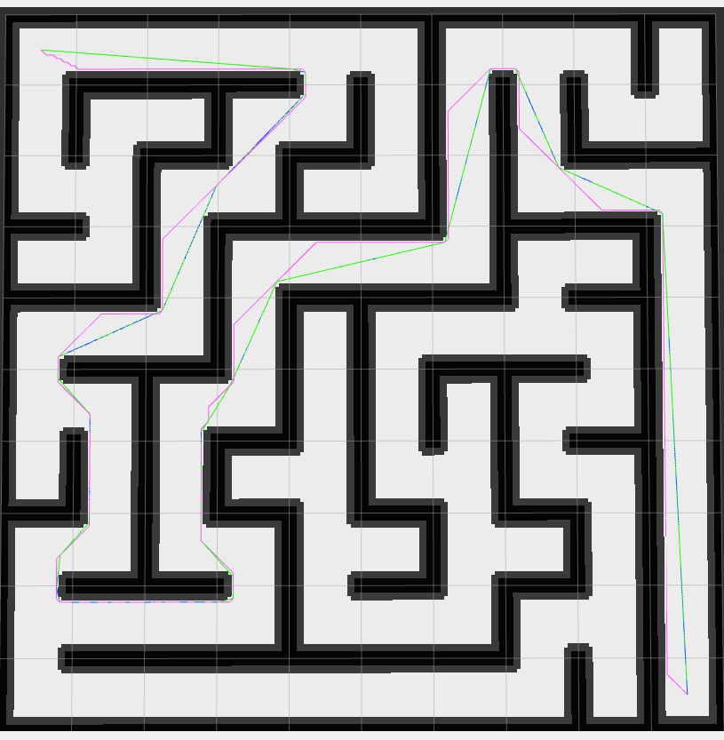
  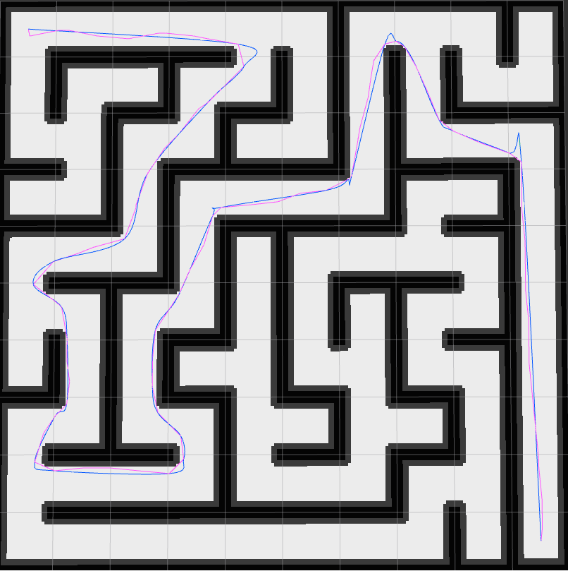
  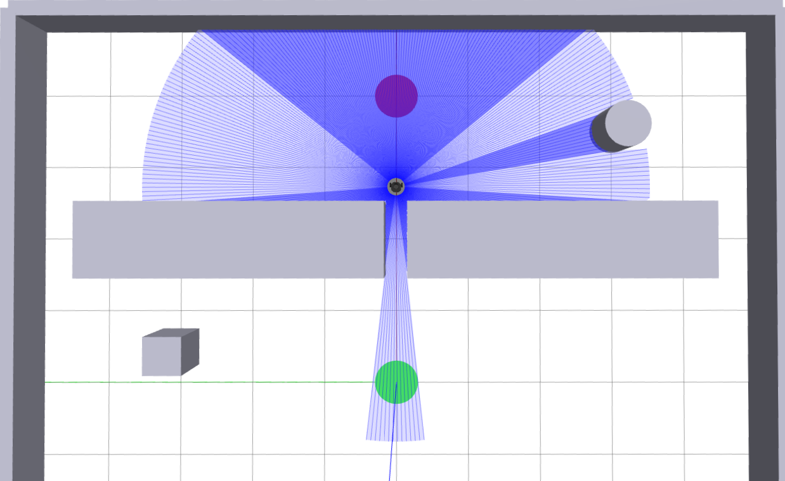
</p>

<p align="center"><sub>Left: A* global path · Center: RRT* global path · Right: reactive APF obstacle avoidance</sub></p>

---

## Overview

This project investigates **three autonomous navigation strategies** for the **TurtleBot3 Burger** in custom Gazebo environments:

- **A*** — graph-search planning over an 8-connected occupancy grid.
- **RRT*** — sampling-based planning with cost-aware parent selection and tree rewiring.
- **Artificial Potential Field (APF)** — map-free, reactive navigation from live LiDAR measurements and the current goal direction.

For **A*** and **RRT***, the robot follows a globally planned and collision-checked path using a **Pure Pursuit** controller. For **APF**, a separate controller directly computes velocity commands at **20 Hz**, without subscribing to the static map or a precomputed path.

The repository includes **three custom Gazebo worlds**, their **static occupancy maps**, launch files, visualization publishers, and performance instrumentation. The accompanying academic report evaluates **planning time, path length, execution time, and success/failure** across the three test environments.

### Highlights

- Static-map ingestion using `nav2_map_server` and `nav_msgs/OccupancyGrid`.
- Configurable **obstacle inflation** (default: **0.12 m**) for footprint clearance.
- A* diagonal corner-cutting prevention; RRT* collision checks and rewiring.
- Line-of-sight path simplification, **Catmull–Rom smoothing**, and collision-aware fallback.
- Waypoint densification for robust tracking through sharp corners.
- Live APF attraction/repulsion visualization in RViz2.
- Reproducible launch configurations and runtime metrics exposed through ROS topics.

## Contents

- [System architecture](#system-architecture)
- [Algorithms](#algorithms)
- [Simulation environments](#simulation-environments)
- [Installation](#installation)
- [Running the project](#running-the-project)
- [ROS interfaces and visualization](#ros-interfaces-and-visualization)
- [Configuration](#configuration)
- [Experimental results](#experimental-results)
- [Repository structure](#repository-structure)
- [Troubleshooting and limitations](#troubleshooting-and-limitations)
- [References](#references)

## System architecture

The project provides **two distinct navigation pipelines**:

```text
GLOBAL NAVIGATION (A* / RRT*)
Static map ──► Nav2 map server ──► Occupancy-grid inflation
                                           │
                                           ▼
                                   A* or RRT* planner
                                           │
                                           ▼
                           Simplification + collision-safe smoothing
                                           │
                                           ▼
                               Waypoint densification
                                           │
                                           ▼
                              Pure Pursuit path tracker
                                           │
                                           ▼
                                        /cmd_vel

REACTIVE NAVIGATION (APF)
/scan ──────────┐
                ├──► Attractive + Gaussian repulsive forces
TF / goal pose ─┘                      │
                                      ▼
                           Safety and velocity mapping
                                      │
                                      ▼
                                   /cmd_vel
```

**Note:** A* and RRT* are **global planners**, while APF is a **reactive controller**; comparing their computation times therefore means comparing different types of computation. Global planning produces a complete route before execution, whereas APF continually updates the motion command.

## Algorithms

### 1. A* — heuristic graph search

A* searches an **8-connected grid** using horizontal, vertical, and diagonal moves. Each cell is weighted by the accumulated path cost and a goal-directed heuristic:

```math
f(n) = g(n) + h(n)
```

With the default Euclidean heuristic:

```math
h(n) = r\sqrt{(x_n-x_g)^2 + (y_n-y_g)^2}
```

Here, $r$ is the grid resolution (**0.05 m/cell** in the supplied maps); $g(n)$ is the cost of reaching node $n$; and $(x_g,y_g)$ is the goal cell. The implementation rejects moves into inflated obstacles and prevents diagonal corner cutting between blocked cells.

### 2. RRT* — asymptotically optimal sampling-based planning

RRT* expands a collision-free tree toward sampled locations. Unlike basic RRT, it chooses a low-cost parent among nearby nodes and **rewires** existing branches when a better connection becomes available.

```math
q_{\mathrm{parent}}^{*} =
\underset{q\in\mathcal{N}(q_{\mathrm{new}})}{\operatorname{arg\,min}}
\left[J(q) + \lVert q-q_{\mathrm{new}}\rVert_2\right]
```

The implementation uses a fixed iteration budget, goal-biased sampling, a configurable extension step, and a neighborhood radius for rewiring. Line-of-sight collision checking is performed against the inflated occupancy grid.

<p align="center">
  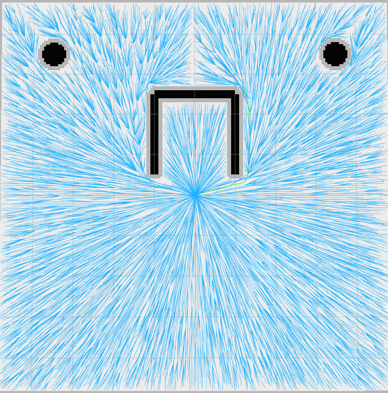
  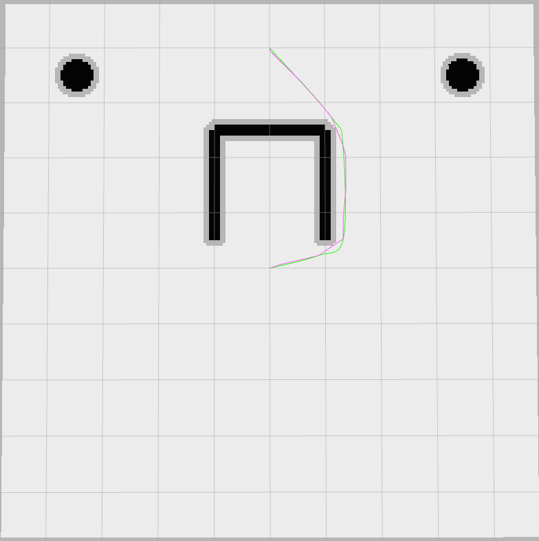
</p>

<p align="center"><sub>RRT* exploration tree and the extracted path in the local-minima scenario.</sub></p>

### 3. Collision-aware path refinement and Pure Pursuit

Both global planners share the same post-processing pipeline:

1. **Inflate** occupied cells around obstacles to account for robot clearance.
2. **Simplify** the raw route by connecting waypoints with obstacle-free line segments.
3. **Smooth** with a Catmull–Rom cubic spline when the resulting curve stays collision-free.
4. **Fall back** to the collision-free simplified path when the spline cuts into an inflated obstacle.
5. **Densify** the final path (default maximum waypoint spacing: **0.05 m**) for tracking.

Pure Pursuit chooses a waypoint ahead of the robot and converts its bearing into angular velocity:

```math
\kappa = \frac{2\sin(\alpha)}{L_d},
\qquad \omega = v\kappa
```

where $\alpha$ is the heading error and $L_d$ is the configured lookahead distance. The controller slows for turns, rotates in place when the heading error is large, and stops when the goal tolerance is satisfied.

> **Why densification matters:** A sparse but collision-free route can cause a waypoint-based lookahead controller to skip around a sharp corner. Densifying the published path helps avoid such tracking failures, particularly in the sharp-maze experiment.

### 4. APF — LiDAR-based reactive navigation

APF defines an attractive potential around the goal and Gaussian radial-basis repulsive potentials around nearby obstacles:

```math
U(\mathbf{x}) =
\frac{1}{2}(\mathbf{x}-\mathbf{x}_g)^\top
K_g(\mathbf{x}-\mathbf{x}_g)
+
\frac{\alpha}{N}\sum_{i=1}^{N}\exp\!\left(
-\frac{1}{2}(\mathbf{x}-\mathbf{o}_i)^\top
\Sigma^{-1}(\mathbf{x}-\mathbf{o}_i)
\right)
```

For $N>0$ contributing LiDAR points, this normalized potential matches the implemented repulsive-force average before force clipping. The desired motion direction follows its negative gradient:

```math
\mathbf{F}_{\mathrm{total}}
= \mathbf{F}_{\mathrm{att}} + \mathbf{F}_{\mathrm{rep}}
= -\nabla U(\mathbf{x})
```

In the implementation, the robot is the origin of the local `base_footprint` frame; attraction uses the goal vector transformed through TF, while repulsion is calculated from valid `/scan` samples within an influence radius. The repulsive sum is **normalized by the number of contributing scan points**, and individual/total forces are limited before being mapped to linear and angular velocity.

Safety logic slows the robot near obstacles and, when a front obstacle is too close, **halts forward movement and rotates toward the side with more clearance**.

<p align="center">
  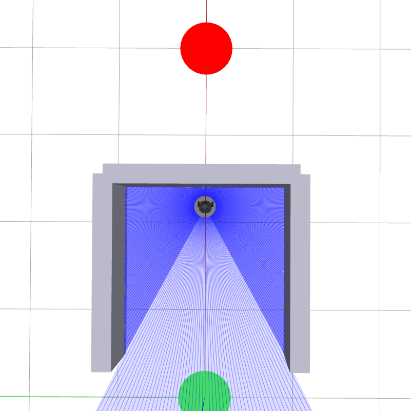
  
</p>

<p align="center"><sub>APF can become trapped by competing forces (left), but can navigate a narrow opening reactively (right).</sub></p>

## Simulation environments

| Environment | Start $(x,y)$, m | Goal $(x,y)$, m | Challenge |
|---|---:|---:|---|
| **Local Minima Trap** (`local_minima`) | (0, 0) | (4, 0) | Concave obstacle and potential-field deadlock |
| **Narrow Passage** (`narrow_passage`) | (0, 0) | (4, 0) | Limited clearance and inflation sensitivity |
| **Sharp Maze** (`sharp_maze`) | (-4.5, -4.5) | (4.5, 4.5) | Long corridors, many turns, and path-tracking challenges |

<p align="center">
  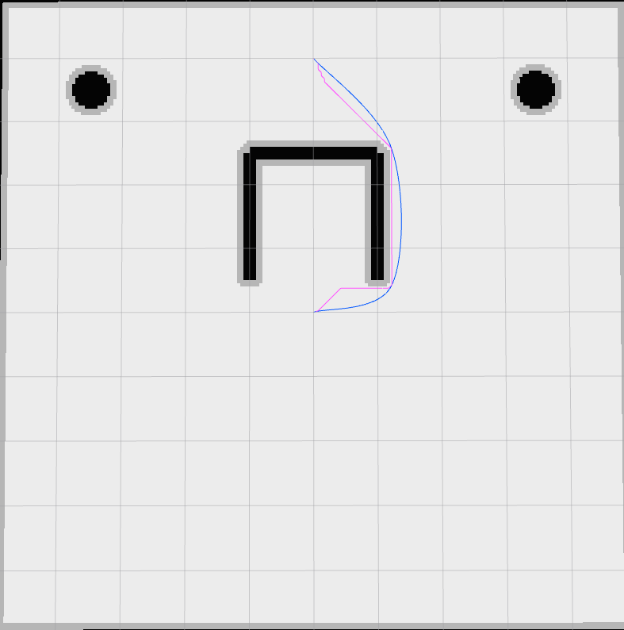
  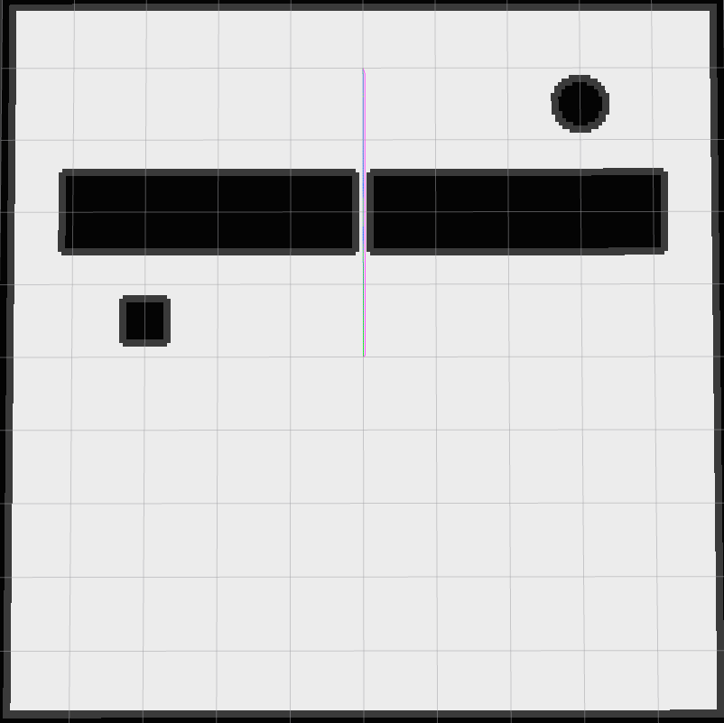
  
</p>

<p align="center"><sub>Local Minima Trap · Narrow Passage · Sharp Maze (A* visualizations).</sub></p>

The maps are provided as **PGM + YAML**, with **0.05 m resolution** and the corresponding Gazebo `.world` files under `maps/` and `worlds/`.

## Installation

### Prerequisites

- **Ubuntu 22.04 + ROS 2 Humble** (recommended for this Gazebo Classic-based launch configuration).
- **Gazebo Classic**, `gazebo_ros`, `turtlebot3_gazebo`, and the **TurtleBot3** ROS packages.
- **Nav2** `nav2_map_server` and `nav2_lifecycle_manager`.
- Python 3 with **NumPy**, **colcon**, and **rosdep**.

Install ROS 2 and the TurtleBot3 simulation dependencies using the official guides linked under [References](#references). The launch files in this project use `gzserver.launch.py`, `gzclient.launch.py`, and the ROS–Gazebo Classic integration; they are **not written for modern Gazebo Sim** without adaptation.

### Build the package

Use a ROS 2 workspace with the **package directory** (`package.xml`, `setup.py`, `launch/`, etc.) placed under `src/`:

```bash
source /opt/ros/humble/setup.bash
mkdir -p ~/tb3_ws/src
cd ~/tb3_ws/src

# Replace this URL with your GitHub repository URL.
git clone https://github.com/YOUR_USERNAME/YOUR_REPOSITORY.git tb3_path_planning

cd ~/tb3_ws
rosdep install --from-paths src --ignore-src -r -y
colcon build --symlink-install --packages-select tb3_path_planning
source install/setup.bash
export TURTLEBOT3_MODEL=burger
```

> **Archive layout:** In the original submitted ZIP, the ROS package is located at `Project4_code/tb3_path_planning/`. If you upload that package directory as your repository root, the clone-and-build example above applies directly. Otherwise, copy the package folder into `~/tb3_ws/src/`.

> [!IMPORTANT]
> **APF source fix required:** The supplied `tb3_path_planning/apf_reactive_controller.py` contains a stray `r.` on line 47, immediately after the `base_frame` parameter declaration. **Remove that line** before running APF. The README documents the archive as supplied and does not silently change the application code.

## Running the project

### A* and RRT*: global navigation

**Terminal 1 — publish the map-to-odometry transform.** The source launch files do not create this transform, but the Pure Pursuit tracker needs a valid `map` → `base_footprint` TF chain.

For **Local Minima** and **Narrow Passage**:

```bash
source ~/tb3_ws/install/setup.bash
ros2 run tf2_ros static_transform_publisher --x 0 --y 0 --z 0 --roll 0 --pitch 0 --yaw 0 --frame-id map --child-frame-id odom
```

For **Sharp Maze**, use the corresponding spawn offset instead:

```bash
source ~/tb3_ws/install/setup.bash
ros2 run tf2_ros static_transform_publisher --x -4.5 --y -4.5 --z 0 --roll 0 --pitch 0 --yaw 0 --frame-id map --child-frame-id odom
```

**Terminal 2 — start the complete simulation.** Choose **one** command:

```bash
# A* in the local-minima environment
ros2 launch tb3_path_planning demo.launch.py environment:=local_minima algorithm:=astar

# RRT* in the narrow passage
ros2 launch tb3_path_planning demo.launch.py environment:=narrow_passage algorithm:=rrt_star

# A* in the sharp maze
ros2 launch tb3_path_planning demo.launch.py environment:=sharp_maze algorithm:=astar
```

You can use either `astar` or `rrt_star` with any of the three environments.

### APF: reactive navigation

APF starts Gazebo and the reactive controller **without launching `nav2_map_server` or Pure Pursuit**. After applying the source fix above, run:

```bash
ros2 launch tb3_path_planning demo.launch.py environment:=local_minima algorithm:=apf
ros2 launch tb3_path_planning demo.launch.py environment:=narrow_passage algorithm:=apf
ros2 launch tb3_path_planning demo.launch.py environment:=sharp_maze algorithm:=apf
```

Run these **one at a time**. APF uses `odom` as its default goal frame, with goals `(4, 0)`, `(4, 0)`, and `(9, 9)` respectively; the sharp-maze goal is expressed **relative to the robot's spawn position**.

For a controller-only launch (if a compatible simulation and TF tree are already running):

```bash
ros2 launch tb3_path_planning apf.launch.py environment:=narrow_passage
```

### Parameter override examples

```bash
# Global planning: reduce lookahead for tight turns
ros2 launch tb3_path_planning demo.launch.py \
  environment:=sharp_maze algorithm:=astar \
  inflation_radius:=0.12 lookahead_distance:=0.15 \
  tracking_waypoint_spacing:=0.04

# Reactive control: adjust repulsive strength and influence radius
ros2 launch tb3_path_planning demo.launch.py \
  environment:=narrow_passage algorithm:=apf \
  repulsive_alpha:=0.80 repulsive_influence_radius:=0.75
```

> The parameter overrides are tuning examples, **not validated performance improvements**. Restart each scenario in a fresh Gazebo session and do not run APF and Pure Pursuit simultaneously, since both can publish to `/cmd_vel`.

## ROS interfaces and visualization

### Topics

| Topic | Message type | Produced/used by | Purpose |
|---|---|---|---|
| `/map` | `nav_msgs/OccupancyGrid` | Map server → global planner | Static occupancy grid |
| `/inflated_costmap` | `nav_msgs/OccupancyGrid` | Global planner | Robot-clearance grid |
| `/raw_path` | `nav_msgs/Path` | Global planner | Unprocessed planned route |
| `/smoothed_path` | `nav_msgs/Path` | Global planner | Collision-checked smoothed route |
| `/planned_path` | `nav_msgs/Path` | Global planner → Pure Pursuit | Densified controller route |
| `/rrt_star_tree` | `visualization_msgs/MarkerArray` | RRT* planner | Sampled tree visualization |
| `/global_planning_time` | `std_msgs/Float64` | Global planner | Global search runtime, seconds |
| `/path_execution_time` | `std_msgs/Float64` | Pure Pursuit | Travel time to goal, seconds |
| `/scan` | `sensor_msgs/LaserScan` | LiDAR → APF | Live obstacle measurements |
| `/apf_markers` | `visualization_msgs/MarkerArray` | APF | Forces and LiDAR samples |
| `/apf_execution_time` | `std_msgs/Float64` | APF | Reactive travel time to goal, seconds |
| `/cmd_vel` | `geometry_msgs/Twist` | Pure Pursuit **or** APF | Differential-drive commands |

### RViz2

Start RViz2 in another terminal:

```bash
source ~/tb3_ws/install/setup.bash
rviz2
```

For **global planning**, select **Fixed Frame: `map`** and add *Map*, *Path*, and *MarkerArray* displays with their topics from the table above. For **APF**, use a valid `base_footprint` or `odom` fixed frame and display `/apf_markers`.

APF marker colors: **green** = attraction, **red** = repulsion, **blue** = total force, **orange** = LiDAR samples.

For metrics, inspect the corresponding topics:

```bash
ros2 topic echo /global_planning_time
ros2 topic echo /path_execution_time
# For APF runs:
ros2 topic echo /apf_execution_time
```

## Configuration

Representative **default parameters from the source code and launch files**:

| Component | Parameter | Default | Meaning |
|---|---|---:|---|
| Global planner | `inflation_radius` | `0.12` m | Obstacle clearance margin |
| Global planner | `heuristic` | `euclidean` | A* heuristic (`manhattan` also supported) |
| RRT* | `rrt_max_iterations` | `15000` | Maximum tree expansion attempts |
| RRT* | `rrt_step_size` | `0.25` m | Sampling-tree extension distance |
| RRT* | `rrt_rewire_radius` | `0.60` m | Local rewiring neighborhood |
| RRT* | `rrt_goal_sample_rate` | `0.12` | Probability of goal-biased sampling |
| Global planner | `tracking_waypoint_spacing` | `0.05` m | Final path point spacing |
| Pure Pursuit | `lookahead_distance` | `0.20` m | Lookahead waypoint distance |
| Pure Pursuit | `control_frequency` | `20` Hz | Velocity control update rate |
| APF | `goal_tolerance` | `0.12` m | Distance required to finish |
| APF | `attractive_kx`, `attractive_ky` | `1.20`, `1.20` | Goal attraction gains |
| APF | `repulsive_alpha` | `0.65` | Gaussian repulsive gain |
| APF | `repulsive_sigma_x`, `repulsive_sigma_y` | `0.35`, `0.25` | Gaussian width parameters |
| APF | `repulsive_influence_radius` | `0.90` m | Maximum LiDAR obstacle range used |
| APF | `emergency_stop_distance` | `0.18` m | Front clearance threshold |
| APF | `max_v`, `max_w` | `0.20` m/s, `1.80` rad/s | Velocity limits |

## Experimental results

The following results are **transcribed from the accompanying project report**. They represent the authors' reported Gazebo experiments, **not new benchmarks or independent reruns**. Planning time applies to the A*/RRT* global-search stage, and execution time measures navigation to the goal.

| Environment | Method | Global planning (s) | Path length (m) | Execution (s) | Outcome |
|---|---|---:|---:|---:|---|
| Local Minima | **A*** | 0.024677 | 5.429 | 43.198 | Success |
| Local Minima | **RRT*** | 7.413392 | 5.467 | 41.243 | Success |
| Local Minima | **APF** | N/A | — | — | Trapped in local minimum |
| Narrow Passage | **A*** | 0.000850 | 4.000 | 28.149 | Success |
| Narrow Passage | **RRT*** | 7.792055 | 4.000 | 28.366 | Success |
| Narrow Passage | **APF** | N/A | ~4.000 | 60.706 | Success, slower |
| Sharp Maze | **A*** | 0.127179 | 35.394 | 274.723 | Success after path densification |
| Sharp Maze | **RRT*** | 2.641865 | 37.702 | 279.929 | Success |
| Sharp Maze | **APF** | N/A | — | — | Trapped in local minimum |

*`N/A` for APF means there is no separate global-planning stage, not that force computation costs zero. Dashes indicate that the scenario was not completed.*

<p align="center">
  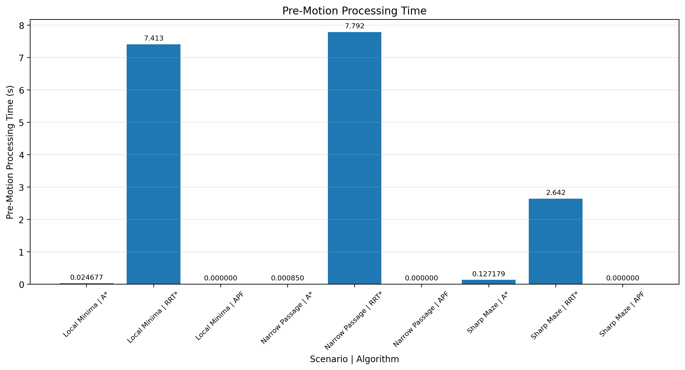
  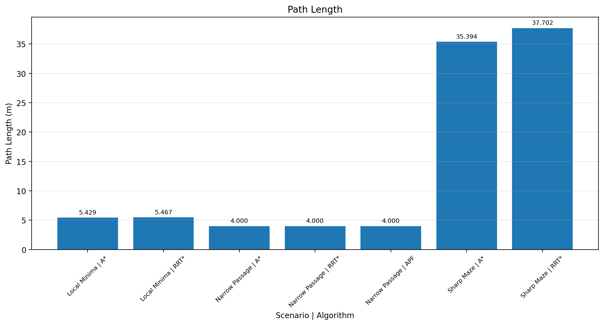
  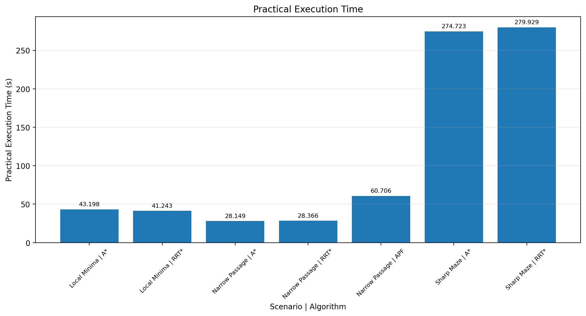
</p>

<p align="center"><sub>Performance figures reproduced from the provided project assets: planning time, path length, and execution time.</sub></p>

### Observations

- **A*** consistently offers the fastest reported global path computation in these test maps.
- **RRT*** requires greater planning effort but can produce a geometrically different, trackable route via rewiring.
- **APF** reaches the goal in the narrow passage but is prone to **local minima** near concave obstacles and maze corridors.
- **Path quality and controller compatibility matter**: sparse waypoints can undermine trajectory execution even when the global path is collision-free.
- The **inflation radius** controls a safety-versus-reachability trade-off. In the narrow-passage experiment, increasing it to **0.20 m** led to a substantial detour.

<p align="center">
  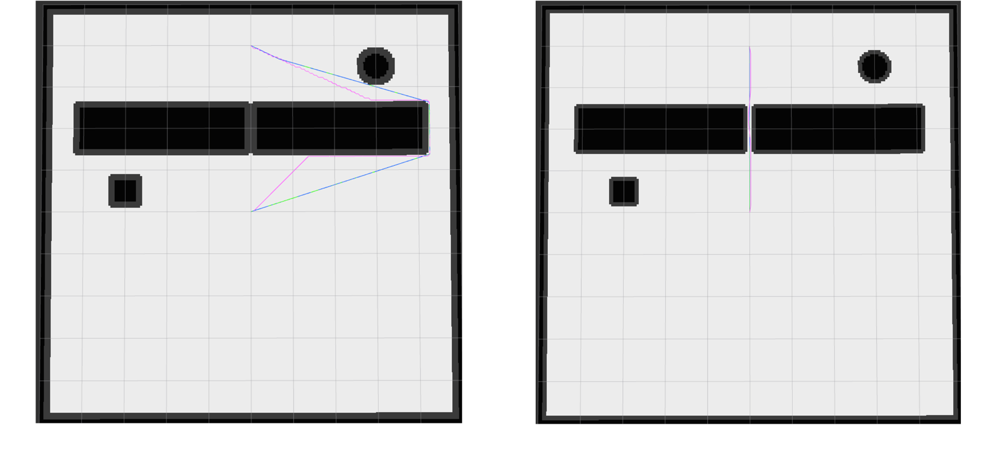
</p>

<p align="center"><sub>Effect of obstacle inflation on traversability in the narrow-passage environment.</sub></p>

## Repository structure

```text
tb3_path_planning/                 # ROS 2 Python package / suggested repository root
├── README.md                     # This document
├── docs/
│   └── images/                   # Selected experiment figures
├── launch/
│   ├── demo.launch.py            # Gazebo + selected navigation stack
│   ├── planner.launch.py         # Map server + global planner + Pure Pursuit
│   ├── apf.launch.py             # Reactive APF controller
│   ├── spawn_local_minima.launch.py
│   ├── spawn_narrow_passage.launch.py
│   └── spawn_sharp_maze.launch.py
├── maps/                         # PGM/YAML occupancy maps
├── worlds/                       # Custom Gazebo environments
├── tb3_path_planning/
│   ├── global_planner.py         # A*, RRT*, inflation, smoothing
│   ├── pure_pursuit.py           # Path tracking
│   └── apf_reactive_controller.py # Reactive APF and visualization
├── resource/
├── test/                         # Package lint/test scaffolding
├── package.xml
├── setup.py
└── setup.cfg
```

The **original archive** also includes a separate `report.pdf` describing the mathematical approach and reported experiments.

## Troubleshooting and limitations

<details>
<summary><strong>APF fails to start with a Python syntax error</strong></summary>

The source archive has an accidental `r.` line in `tb3_path_planning/apf_reactive_controller.py` just before `self.declare_parameter('goal_frame', 'odom')`. Remove that line and rebuild the package.

</details>

<details>
<summary><strong>Pure Pursuit publishes zero velocity or cannot resolve TF</strong></summary>

Check that `map`, `odom`, and `base_footprint` form a connected TF chain. Start the static `map` → `odom` transform appropriate for the selected world (see [Running the project](#running-the-project)). Do not run duplicate publishers for the same transform.

</details>

<details>
<summary><strong>Robot clips a corner or oscillates in the maze</strong></summary>

Inspect `/planned_path` and `/inflated_costmap` in RViz2. Tune `lookahead_distance`, `tracking_waypoint_spacing`, and inflation conservatively. The implemented planner performs collision checks during smoothing, but execution still depends on controller tuning and localization/TF accuracy.

</details>

<details>
<summary><strong>APF gets stuck even though an obstacle-free route exists</strong></summary>

This is a known limitation of local potential-field navigation: attraction and repulsion can cancel at a non-goal equilibrium. The algorithm has no global map-based route or escape planner and **does not guarantee reaching the goal**.

</details>

<details>
<summary><strong>Gazebo launch files are missing or incompatible</strong></summary>

The simulation launches target **Gazebo Classic** (`gzserver`/`gzclient`) through `gazebo_ros`. Verify that the matching Humble packages and TurtleBot3 simulations are installed. Modern Gazebo Sim launch files are not drop-in replacements.

</details>

**Scope:** These are research/coursework implementations for simulation-based comparison. Global planners assume a static occupancy grid and plan a route rather than continually replanning around dynamic obstacles. Results may vary with system configuration, simulation timing, and controller parameters. **Real-robot deployment would require additional validation and safety measures.**

## References

- [ROS 2 Humble documentation](https://docs.ros.org/en/humble/index.html)
- [ROBOTIS TurtleBot3 — Quick Start](https://emanual.robotis.com/docs/en/platform/turtlebot3/quick-start/)
- [ROBOTIS TurtleBot3 — Gazebo Simulation](https://emanual.robotis.com/docs/en/platform/turtlebot3/simulation/)
- [GitHub — Rendering mathematical expressions in Markdown](https://docs.github.com/en/get-started/writing-on-github/working-with-advanced-formatting/writing-mathematical-expressions)

---

**Academic context:** Advanced Robotics, Project 4. Figures and numerical results are taken from the materials supplied with this project. The ROS package metadata declares the software license as **Apache-2.0**; include an appropriate `LICENSE` file when publishing the repository.
